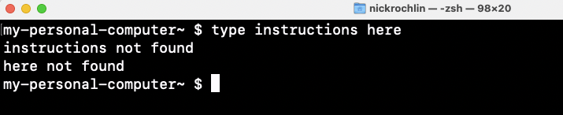

# Hands-On Activities Introduction

Please review the following content:

## Section Overview

-   What is the Unix Shell?
-   Exploring files and directories
-   Absolute vs. relative paths
-   Putting it all together

Before introducing the Unix Shell, it may be valuable to start by
introducing the graphical user interface (GUI). This is the most widely
used way to interact with a personal computer, and the one that you are
most likely familiar with. The GUI allows you to see various icons and
applications, and to use a mouse to navigate your way through the
computational landscape.

[source](https://learn.microsoft.com/en-us/windows/wsl/tutorials/gui-apps)
[source](https://www.makeuseof.com/how-to-open-mac-apps/)

  

As opposed to this graphical interface that can be navigated with a
mouse, the Unix Shell is a way of interacting with your computer by
providing it with textual instructions. In this vein, you can think of
the shell as a box in which you type instructions for your computer to
execute.

 

It’s worth noting that there are different “brands” of shell that look
different, but that work the same (more or less. The truth is actually
more nuanced, but for the purposes of this session, you can think of the
different types of shells working *almost* the same).

Regardless of the brand/look of shell, each shell begins with where you
are in the computer. As an example, these are 3 different shells, all in
my personal documents folder:

 

Each shell also has a **prompt**, which indicates that the shell is
waiting for input. The prompts differ across each type of shell, but can
include symbols like ‘>’, ‘%’, ‘$’:

Going back to the concept of the shell as a box in which you type
instructions to your computer to execute, it needs to be mentioned that
it does not accept human language commands, and that it has its own
vocabulary and grammar.

### Why use the shell?

With this in mind, you might be thinking to yourself, “why would I ever
want to use this?? I know how my computer works, and don’t need to learn
a new language!” While you would be completely reasonable in thinking
that, the shell can offer a great deal of value in how you work with
your computer. On a foundational level, if you are using or are
interested in using any coding languages, having a basic understanding
of how your computer arranges and sorts through files and folders will
be hugely beneficial, and will reduce a lot of the confusion that can
arise when learning to code. It can also be much more efficient in
moving around files and folders, and if you find that there are certain
movement tasks that you do regularly, it allows you to easily automate
and repeat those tasks. Moving onto more advanced functions, it can
serve as a key piece in data workflows and pipelines, working in
conjunction with other coding languages and digital tools you are using.
And for the super-users out there, it is also the easiest way to work
with remote machines and high-performance computing clusters.

This is all to say that there’s a lot of value in the Unix Shell, but it
does require a bit of work to get there. With that said, let’s jump into
it!

 

