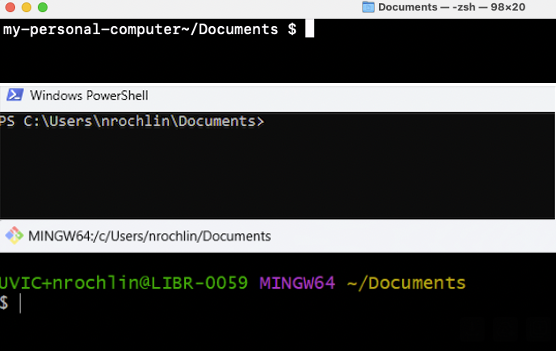

# Hands-On Activities Introduction

Please review the following content:

## Section Overview

-   What is the Unix Shell?
-   Exploring files and directories
-   Absolute vs. relative paths
-   Putting it all together

Before introducing the Unix Shell, it may be valuable to start by
introducing the graphical user interface (GUI). This is the most widely
used way to interact with a personal computer, and the one that you are
most likely familiar with. The GUI allows you to see various icons and
applications, and to use a mouse to navigate your way through the
computational landscape.

[source](https://learn.microsoft.com/en-us/windows/wsl/tutorials/gui-apps)
[source](https://www.makeuseof.com/how-to-open-mac-apps/)

  

As opposed to this graphical interface that can be navigated with a
mouse, the Unix Shell is a way of interacting with your computer by
providing it with textual instructions. In this vein, you can think of
the shell as a box in which you type instructions for your computer to
execute.

 

It’s worth noting that there are different “brands” of shell that look
different, but that work the same (more or less. The truth is actually
more nuanced, but for the purposes of this session, you can think of the
different types of shells as working *almost* the same).

Regardless of the brand/look of shells, each shell begins with information about where you
are in the computer. As an example, these are 3 different shells, all in
my personal documents folder:

 

Each shell also has a **prompt**, which indicates that the shell is
waiting for input. The prompts differ across each type of shell, but can
include symbols like ‘>’, ‘%’, ‘$’:

Going back to the concept of the shell as a box in which you type
instructions for your computer to execute, it needs to be mentioned that
it does not accept human language commands, and that it has its own
vocabulary and grammar.

 

