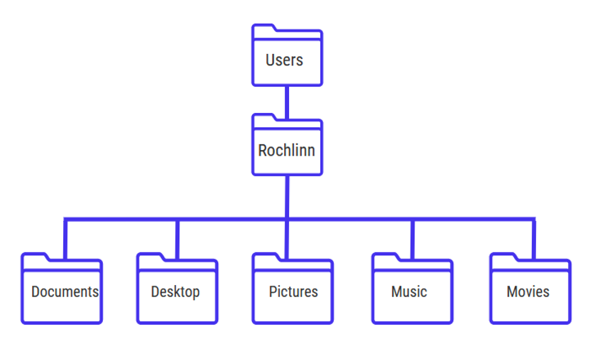
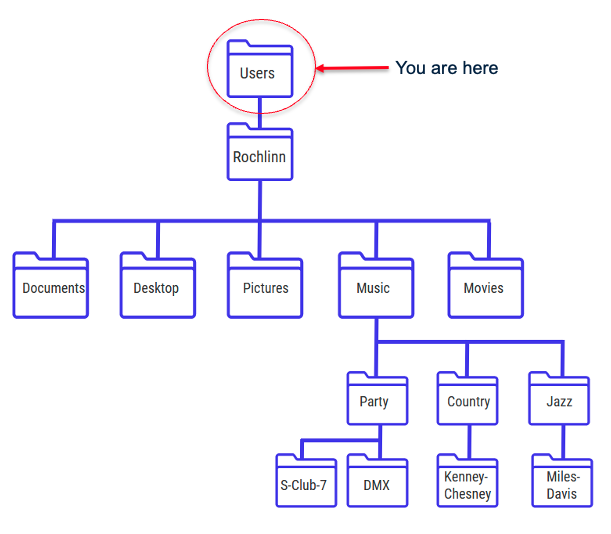

# File and Directory Paths

Before we jump into some Unix commands, it’s worth defining two key
terms:

**Files**: Objects on a computer that store data, information, settings,
or commands when used with a computer program.

**Directories**: Also called “folders”, are the units that hold files or
other directories.

## Paths

A path is a string of characters that specifies a unique location in a
directory hierarchy. A file path specifies the location of a file in a
computer’s file system structure.

The below picture illustrates the directory structure of a typical
computer. Within this structure, the path to my Desktop would be:

**/Users/Rochlinn/Desktop**

When dealing with paths, directories are denoted by a slash “/”, and
each “layer” of the directory hierarchy is separated with a slash.

> ## **Exercise 1**
>
> Take a look at the directory structure below:
>
> *  What’s the path to the Music directory?
> *  What’s the path to the S-Club 7 directory?
>
><a href="https://padlet.com/nickrochlin/unix-exercise-1-20n5h6wvprgldkna" target="_blank">Answer questions in Padlet</a>

 

[NEXT STEP: Navigating Files and Directories](navigating-files-directories.html){: .btn .btn-blue}

