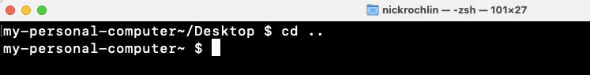
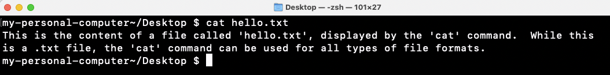
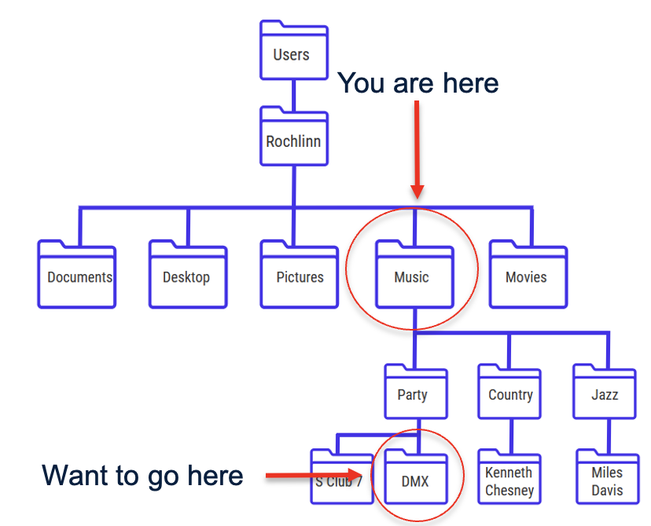

# Navigating Files and Directories

Now that we’ve discussed file and directory paths, let’s open our terminals and jump into some
Unix commands to start navigating through files and folders. An
invaluable tip for Unix commands (and most coding languages), is to know
that the internet has a ton of documentation on what commands do and how
to solve issues. When playing around with these commands, it’s highly
recommended to use a search engine to help you!

 

`pwd`

-   Stands for “print working directory”, and will display the full path
    of where you currently are on your machine.

 

`ls`

-   Lists the contents of a directory.

 

`cd`

-   Changes the directory you are in.
-   Syntax: \`cd + {path/to/directory}

 

`cd ..`

-   Moves you up one directory

 

`cat`

-   Prints the whole contents of a file (does not work on directories)
-   Syntax: `cat + {file-name}`

 

## Absolute vs. Relative Paths

As you start playing around in the Unix Shell, it’s good to know that
there are two types of paths that you can use: absolute and relative
paths.

**Absolute Paths**: Includes the entire path from the root directory.

  

**Relative Path**: Includes the path relative to where you are.

It should be noted that relative paths only work going down the
hierarchy, and not up. In this example, the relative path assumes
`/Users/Rochlinn/Music`

> ## **Exercise 2**
>
> Using the data files that you downloaded at the beginning of the
> session, explore the files and directories with the following prompts:
>
> *  What is the full path to the file `methane.pdb`?
> *  Who is the author of `methane.pdb`?
> *  What command would you use to move from the `proteins` directory
>     to the `shell-lesson-data` directory?
> *  What is the last line of the file `NENE01729A.txt`?
