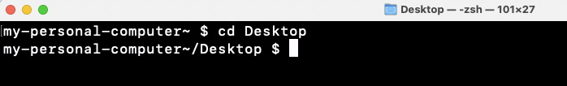

# Navigating Files and Directories

Now that we’ve discussed file and directory paths, let’s open our terminals and jump into some
Unix commands to start navigating through files and folders. An
invaluable tip for Unix commands (and most coding languages), is to know
that the internet has a ton of documentation on what commands do and how
to solve issues. When playing around with these commands, it’s highly
recommended to use a search engine to help you!

 

---

`pwd`

-   Stands for “print working directory”, and will display the full path
    of where you currently are on your machine. Right now, I'm at the root directory of my computer, which means I'm at the highest (functional) point of the directory hirearchy, which is `/Users/nickrochlin`

 

---

`ls`

-   Lists the contents of a directory. Some systems will have different colours for directories and files, but as a rule of thumb, files will always end in a file extension (ie. `.docx`, `.ppt`, `.txt`, etc).  As you can see, my root directory only has sub-directories, and no files.

 

---

`cd`

-   Changes the directory you are in.  
-   Syntax: \`cd + {path/to/directory}`

Let's use this command to move to our `Desktop` directory:

 

---

`cd ..`

-   Moves you up one directory

If I use this command, I'll be moved back to my root directory.  If you're ever unsure of what directory you're in, you can always use the `pwd` command to double check, although the information in the command prompt can also be helpful in figuring this out.

 

---

Now let's move back to our `Desktop` directory by re-entering the command `cd Desktop`.  The files on your Desktop will be different than mine, but if I use the `ls` command here, you will see that I have the `shell-lesson-data` directory that I downloaded in the Pre-Workshop Activities section, as well as a file called `hello.txt`.

If I'm interested in seeing what is in the `hello.txt` file, I can use the `cat` command to display the content.  While this example is being shown on a `.txt` file, the `cat` command works other types of files as well.  (If you're interested, feel free to look into the other files that `cat` works on in a search engine).
`cat`

-   Prints the whole contents of a file (does not work on directories)
-   Syntax: `cat + {file-name}`

 

## Absolute vs. Relative Paths

As you start playing around in the Unix Shell, it’s good to know that
there are two types of paths that you can use: absolute and relative
paths.

**Absolute Paths**: 

* Includes the entire path from the root directory
* The absolute path for the movement below would be: `cd /Users/Rochlinn/Music/Party/DMX`

 

 

**Relative Path**: 

* Includes the path relative to where you are
* The relative path for the movement below would be: `cd /Party/DMX`

It should be noted that relative paths only work going down the
hierarchy, and not up. In this example, the relative path assumes
`/Users/Rochlinn/Music`

 

 

> ## **Exercise 2**
>
> Move to the `shell-lesson-data` directory that you downloaded at the beginning of the session (which should be in your `Desktop` directory), and, explore the files and > directories with the following prompts:
>
> *  What is the full path to the file `methane.pdb`?
> *  Who is the author of `methane.pdb`?
> *  What command would you use to move from the `alkanes` directory
>     to the `shell-lesson-data` directory?
> *  What is the last line of the file `NENE01729A.txt`?
>
> <a href="https://padlet.com/nickrochlin/unix-exercise-2-dl2teclv5hpcj12c" target="_blank">Answer questions in Padlet</a>

 
