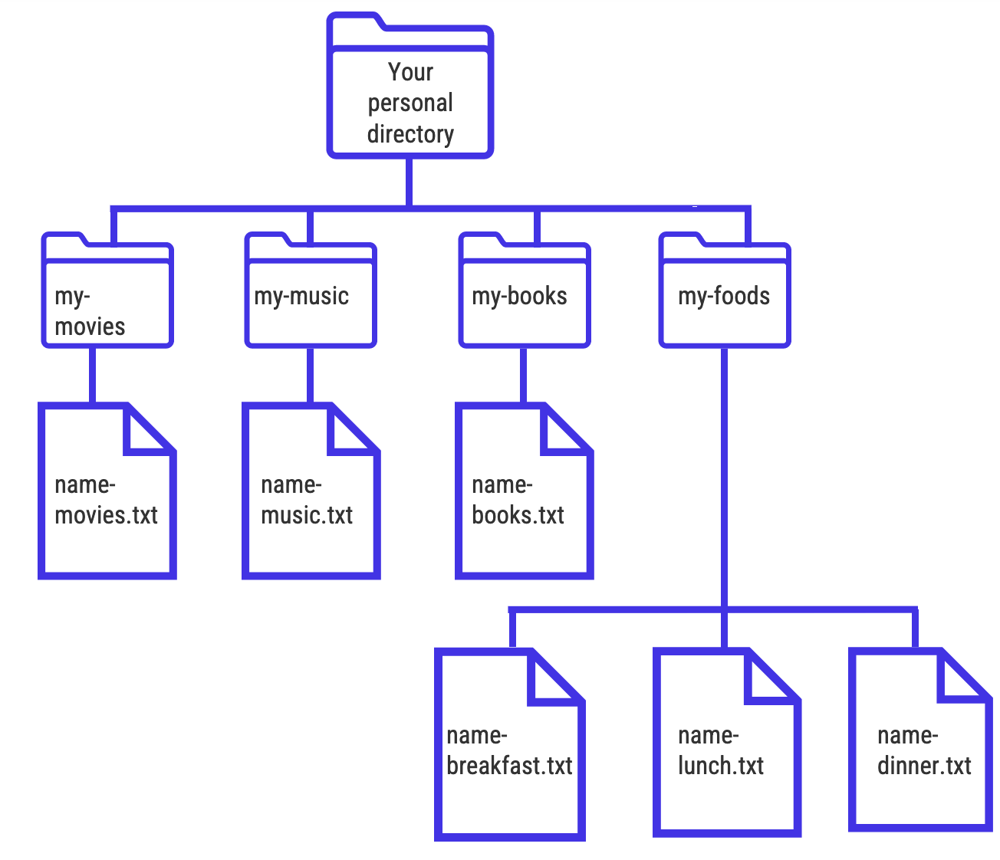

# Working with Files and Directories

Now that we’ve seen how to navigate files and directories in the shell,
it’s time to get our hands dirty and to start using the shell to create
a directory hierarchy and populate it with files.

## Creating a Directory

To begin, use the `cd` command to move to the `shell-lesson-data`
directory on your computer (you can double check that you’re in this
directory using the `pwd` command). The first thing that we’re going to
do is create a new directory within the `shell-lesson-data` directory.

**`mkdir`**

-   Make a new directory
-   Syntax: `mkdir + {new-directory-name}`

Using this command, create a new directory, \*choosing whatever name you
like.

 

------------------------------------------------------------------------

**A quick note on naming** The shell is quite particular in how it
parses and sorts information, and a number of special characters have
function in the shell. Knowing &gt; that, following the file naming
recommendations below will save you a lot of headaches:

-   Only contain letters in the English alphabet, numbers 0-9, dashes -,
    and underscores \_
-   Do not use spaces or special characters such as: `!@#$%^&*()_+[]{}|`
-   Separate naming elements with underscores and dashes

------------------------------------------------------------------------

 

After creating this new directory, move into it using the `cd` command.

## Creating a Text File

Nano is a text editor that can be used to create and edit plain text
files via the shell. When we say “plain text”, it means that these files
can only work with plain characters, and doesn’t work with tables,
images, or any other media. There are many different text editors to
choose from, but for the purpose of this lesson, we are going to use
Nano because it’s one of the least complicated. As you move forward in
your Unix journey, feel free to explore and play with different brands
of text editors. In this lesson we’ll be working with .txt files, but
there are other plain text file types that can be explored.

**Nano syntax:**

-   `nano` - opens text editor
-   `nano + new-file-name` - opens text editor and creates a new file
    with a specified name. You will need to enter `.txt` after the file
    name so that Nano knows what kind of file to create
-   `nano + existing-file-name` - opens text editor to an existing file

**Closing nano**

Closing a text editor isn’t always the most intuitive thing (a big
reason why Nano was chosen for this lesson as opposed to other editors).
To close Nano, follow the steps below:

1.  `Ctrl + x` - initiates closing the editor
2.  You will then see text at the bottom of the shell that says, “Save
    modified buffer?” If you would like to save your file, press `y`, if
    not, press `n`
3.  If you pressed `y` to save your file, Nano will ask you to provide a
    file name. If you specified a file name when initiating Nano, or if
    you are editing an existing file, the name will already be written.
    If this is an unnamed file, you can give the file a name, then press
    enter. Nano will close, and the fill is now created!

 

> ## **Exericse 3**
>
> -   In your new personal directory, create 3 .txt files containing:
>     -   Your 3 favourite songs
>     -   Your 3 favourite movies
>     -   Your 3 favourite books
> -   Name each .txt file as you see fit

 

## More Unix Commands

We’re now going to start moving files and directories around to create
hierarchies. Hierarchies can be shallow, meaning that directories
contain files but contain few or no sub-directories. Hierarchies can
also be deep, in that a directory could contain several layers of
sub-directories within it. It is completely up to you how you arrange
your files and directory structures, but it’s always good to try to
think about this structure before you begin a project to keep things as
organized.

`touch`

-   Creates a file that doesn’t have any content
-   Syntax: `touch + new-file-name`

------------------------------------------------------------------------

`cp`

-   Copies a file. There are a few ways that this command can be used:

-   Copy a file to another directory, **keeping the file’s name**

-   Syntax: `cp {file-path/file-name} {target-path}`

-   Example?\*\*\*\*

 

> **Exercise 4**
>
> * In your personal directory, make a new directory called “music”
> * Copy the file with your 3 favourite songs to this directory,
>     keeping the same file name

------------------------------------------------------------------------

`cp`

-   Copy a file to another directory, **changing the file’s name**
-   Syntax: `cp {file-path/file-name} {target-path/new-file-name}`

 

> **Exercise 5**
>
> * In your personal directory, create a new directory called “movies”
> * Copy the file with your 3 favourite movies to this directory,
>     giving the file a new name

------------------------------------------------------------------------

`cp`

-   Copy the file to **same directory that its in**, changing the file’s
    name
-   Syntax: \`cp {file-path/file-name} {same-file-path/new-file-name}
-   Example:\*\*\*\*

 

> **Exercise 6**
>
> * Copy the file containing your 3 favourite books to its current
> directory, giving the file a new name.

------------------------------------------------------------------------

## Danger Zone

We’re now moving on to commands that are a bit more dangerous than those
that have already been discussed, in that files and directories can get
lost or permanently deleted. Always ensure that you’ve backed up all
your important files so you won’t have to deal with any uncessary
headaches.

[source](https://meme-creator.com/meme/146/ralph-in-danger)

------------------------------------------------------------------------

`mv`

Move a file from one destination to another. This command works with the
same syntax as `cp` command, noting that files are being moved instead
of copied. The one unique function that `mv` offers is that it can be
used to change a file’s name, using the following pattern:

-   Change a file’s name, keeping it in the same directory:
-   Syntax: `mv {file-path/file-name} {same-file-path/new-file-name}`

 

> **Exercise 7**
>
> * In your personal directory, change the name of the file containing
> your 3 favourite movies.

------------------------------------------------------------------------

The `mv` command can also be used to change a file’s name when moving it
to a new directory

-   Chane a file’s name, moving it to a new directory
-   Syntax: `mv {file-path/file-name} {target-path/-new-file-name}`

------------------------------------------------------------------------

Now we’re going to move to a command that contains some real danger, in
that it will delete a file with no undo button. Be cautious with this
command, as you won’t be able to easily retrieve files that are deleted
this way.

[source](https://meme-creator.com/meme/146/ralph-in-danger)

------------------------------------------------------------------------

`rm`

-   Removes a file
-   Syntax: `rm {file-path/file-name}`

------------------------------------------------------------------------

## Flags

In addition to the commands that we’ve discussed, there are a number of
“flags” in Unix that allow us to change the behaviour of a command. For
the purpose of this lesson we’ll only be discussing one flag, but for a
comprehensive list, see the “Resources” section at the end of the
lesson.

`-r` flag

This is called the “recursive flag”, and allows commands to operate on
multiple files or whole directories. Without this flag, the previous
commands we learned can only operate on single files.

To use the `r` flag, or any other Unix flag, place it after a command,
and before an argument

Syntax: \`{command} {-flag} {path/directory-or-files}

------------------------------------------------------------------------

Erase a directory \* Syntax: `rm -r {path/directory-name}`

Copy a directory \* Syntax: `cp -r {path/directory-name}`

------------------------------------------------------------------------

## Putting It All Together

Moving back to the directory structure that you’ve created on your
personal machine, we’ve made a bit of a mess! But that’s OK, because
it’s very common for our files to get messy when working on a project.
Let’s try to clean things up and put together a clean structure.

[source](https://www.reddit.com/r/TerrainBuilding/comments/hazxea/update_to_the_parsley_oregano_and_basil_as/)

------------------------------------------------------------------------

> **Exercise 8**
>
> * Create 3 new .txt files:
>
> -   One that contains your favourite breakfast food
> -   One that contains your favourite lunch food
> -   One that contains your favourite dinner food Name the files,
>     respectively, `breakfast.txt`, `lunch.txt`, and `dinner.txt`
>
> * Recreate the directory structure below with the files you’ve been
>     working with. The `my-movies`, `my-music`, `my-books`, and
>     `my-foods` directories contain the .txt files with your favourites:
>
> 
